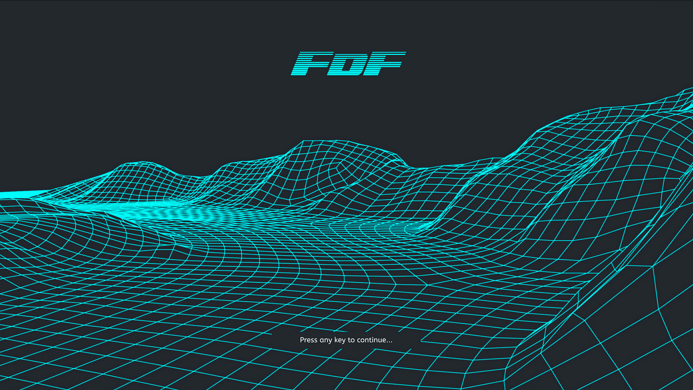

# FDF - Wireframe Model

## Descrição

FDF é um projeto que renderiza um modelo de paisagem em 3D utilizando a biblioteca MiniLibX. Ele interpreta arquivos .fdf contendo coordenadas de altura e desenha um wireframe do terreno correspondente em projeção isométrica.

## Funcionalidades

<ul>
	<li>
		✅ Leitura e interpretação de arquivos .fdf
	</li>
	<li>
		✅ Renderização de mapas em projeção isométrica
	</li>
	<li>
		✅ Manipulação de eventos do teclado e mouse
	</li>
	<li>
		✅ Gerenciamento adequado de memória
	</li>
</ul>

